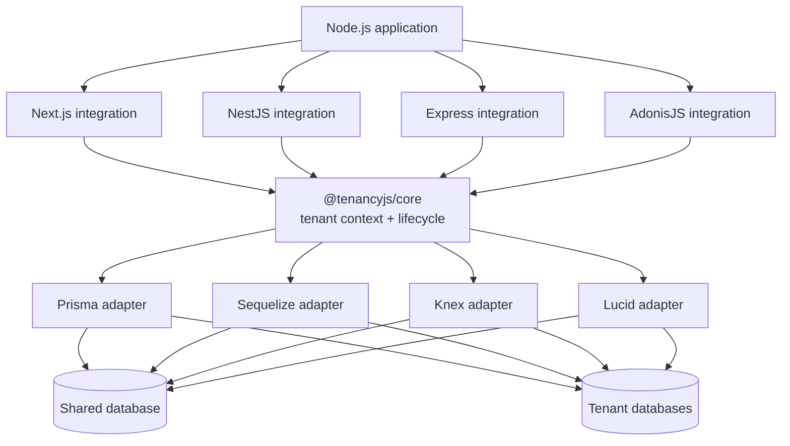

# TenancyJS

**Fail-closed, TypeScript-first multi-tenancy for the Node.js ecosystem—from one database to one
database per tenant.**


TenancyJS is an open-source tenancy toolkit for teams building SaaS products with **Next.js,
NestJS, Express, or AdonisJS** and **Prisma, Sequelize, Knex, or Lucid**. It gives every stack the
same tenant context, isolation contract, test suite, and operational model without replacing the
framework or ORM that already owns your application.

[Vision](#the-vision) · [Strategies](#two-strategies-one-contract) ·
[Compatibility](#compatibility-roadmap) · [Architecture](#architecture) ·
[Roadmap](#delivery-roadmap) · [Development](#development) ·
[Contributing](CONTRIBUTING.md)

> **Pre-alpha:** core, identifiers, testing contracts, Prisma, Express 5, Next.js App Router, the safe
> CLI foundation, and the Knex/PostgreSQL boundary have hosted evidence. The Lucid 22 adapter and its
> PostgreSQL suite are in progress; AdonisJS 7 integration follows. The project is not production-ready.
> Follow the
> [delivery plan](docs/40-features/F-001-tenancyjs-platform/PLAN.md) for implementation state.

---

Multi-tenancy looks simple until one forgotten filter exposes another customer's data. Node.js teams
currently rebuild tenant resolution, async context, query scoping, migration loops, and leak tests for
every framework and ORM combination.

TenancyJS turns those concerns into one explicit, testable system:

```txt
Resolve tenant -> enter isolated context -> scope data access -> run application -> always clean up
```

No process-global tenant. No silent fallback to unscoped access. No compatibility badge without an
integration test proving it.

## The vision

The target developer experience is intentionally small:

```bash
pnpm add @tenancyjs/core @tenancyjs/adapter-prisma @tenancyjs/integration-next
pnpm add -D @tenancyjs/cli @tenancyjs/testing

pnpm tenancy init
pnpm tenancy doctor
pnpm tenancy test:leak
```

Those commands describe the planned public experience; they are not available from npm yet.

Application code should use one mental model everywhere:

```ts
await tenancy.runWithTenant(tenant, async () => {
  // Registered adapters scope supported operations to this tenant.
  // Missing context fails closed by default.
});
```

The core remains framework-neutral. Integrations translate request or job lifecycles into core
context; adapters translate that context into enforceable data-layer behavior.

V1 is aimed primarily at greenfield services that can adopt a secured ORM client from day one.
Existing applications use an incremental inventory-and-test migration path; they are not considered
protected while tenant-aware code can still reach an unextended client.

## Why TenancyJS

- **Fail closed by default.** Tenant-aware access without valid context throws instead of returning
  unscoped data.
- **Concurrency-safe context.** Tenant identity follows the async execution scope, never a mutable
  process-global variable.
- **Two isolation strategies.** Start with shared tables and a tenant key; move selected workloads to
  dedicated tenant databases without changing the application-level context model.
- **Framework-native integration.** Next.js wrappers, NestJS modules, Express middleware, and AdonisJS
  providers follow the lifecycle conventions of each framework.
- **ORM-native operations.** Prisma, Sequelize, Knex, and Lucid keep ownership of migrations and
  schema behavior; the TenancyJS CLI orchestrates rather than reimplements them.
- **Compatibility backed by evidence.** Stable means conformance tests, a runnable example, supported
  peer versions, and a two-tenant no-leak E2E test.
- **One monorepo, separate packages.** Applications install only the integrations and adapters they
  use while the entire project shares one security and release discipline.

## Two strategies, one contract

### Single database

Tenant-owned rows share a database and carry a tenant discriminator such as `tenantId`.

```txt
application database
├── tenants
├── posts       -> tenantId
├── invoices    -> tenantId
└── projects    -> tenantId
```

This is the first delivery target because it gives most SaaS products the lowest operational cost.
Adapters must scope supported create, read, update, delete, aggregate, bulk, nested, and transaction
operations—and fail explicitly where safe interception is impossible.

### Database per tenant

The central registry resolves a tenant to a dedicated database connection. TenancyJS provisions and
iterates tenants while native ORM tools continue to own migrations and seeds.

```txt
central database             tenant databases
├── tenants              ->  acme
├── tenant_domains       ->  globex
└── connection metadata  ->  initech
```

Database-per-tenant support follows the proven row-level contract. It adds bounded concurrency,
connection lifecycle, idempotent provisioning, dry runs, redacted diagnostics, partial-failure
reporting, and recovery tests before it is called stable.

| Concern           | Single database    | Database per tenant                   |
| ----------------- | ------------------ | ------------------------------------- |
| Isolation         | Logical row scope  | Physical database boundary            |
| Operational cost  | Lower              | Higher                                |
| Tenant migrations | One database       | Bounded tenant iteration              |
| Best fit          | Most SaaS products | Regulated or high-isolation workloads |
| Delivery          | First              | After row-level conformance           |

## Compatibility roadmap

Packages are introduced as **experimental** and become **stable** only after their complete evidence
lane passes.

| Vertical slice                 | Target milestone | Current state             |
| ------------------------------ | ---------------: | ------------------------- |
| Express + Prisma               |             v0.1 | PR evidence complete      |
| Next.js App Router + Prisma    |             v0.2 | PR evidence complete      |
| AdonisJS 7 + Lucid 22          |             v0.3 | In progress               |
| Express + Knex                 |             v0.3 | Adapter evidence complete |
| NestJS + Prisma                |             v0.4 | Planned                   |
| NestJS + Sequelize             |             v0.4 | Planned                   |
| Database-per-tenant operations |             v0.5 | Planned                   |

Combinations not listed above are not implied to work merely because their individual packages exist.
See the [test matrix](docs/40-features/F-001-tenancyjs-platform/TEST_PLAN.md).

## Architecture



The dependency direction is enforced: integrations and adapters depend on core, while core imports no
framework or ORM. Lucid remains a dedicated public adapter because its model hooks, IoC lifecycle, Ace
commands, and Japa tests are not generic Knex behavior.

## Packages

| Package                    | Responsibility                                                                 |
| -------------------------- | ------------------------------------------------------------------------------ |
| `@tenancyjs/core`          | Tenant context, lifecycle, events, configuration, and errors                   |
| `@tenancyjs/identifiers`   | Host, subdomain, header, and custom resolver contracts                         |
| `@tenancyjs/adapter-*`     | Prisma, Sequelize, Knex, and Lucid isolation                                   |
| `@tenancyjs/integration-*` | Express, Next.js, NestJS, and AdonisJS lifecycle wiring                        |
| `@tenancyjs/testing`       | Shared isolation and framework conformance suites                              |
| `@tenancyjs/cli`           | Safe initialization, diagnostics, registry, and native operation orchestration |

## Security model

Tenant identity is not user authorization. TenancyJS resolves and propagates a validated tenant; the
host application remains responsible for authentication and membership checks.

The accepted invariants are stricter:

- missing, malformed, unknown, suspended, or ambiguous tenants never become central context;
- central execution and unsafe bypass are explicit privileged APIs;
- cleanup runs on success, rejection, and partial bootstrap failure;
- generated project writes are previewable, path-confined, symlink-safe, and conflict-aware;
- native tools are locally resolved and spawned with argument arrays, never shell command strings;
- secrets are never written to templates or emitted by diagnostics.

Read the [security model](docs/20-security/SECURITY_MODEL.md),
[adapter security contract](docs/20-security/ADAPTER_SECURITY_CONTRACT.md),
[adapter operation matrix](docs/50-quality/ADAPTER_OPERATION_MATRIX.md),
[threat model](docs/20-security/THREAT_MODEL.md), and [security policy](SECURITY.md).

## Delivery roadmap

1. **Foundation — complete** — workspace, quality gates, release discipline, and repository memory.
2. **Core contract — complete** — async tenant context, central context, lifecycle, rollback, and tests.
3. **Identification/testing — complete** — fail-closed resolvers and portable conformance contracts.
4. **Reference slice — complete** — Prisma row-level isolation, Express integration, and safe
   init/Doctor/leak-test CLI foundation have hosted evidence.
5. **Framework depth — in progress** — Next.js App Router is proven; Knex is proven; Lucid 22 and
   AdonisJS 7 are the active vertical slice.
6. **Backend breadth** — NestJS + Prisma/Sequelize and tested adapter combinations.
7. **Physical isolation** — database provisioning and delegated migrations per tenant.
8. **v1 hardening** — compatibility audit, benchmarks, security review, and stable API commitment.

The detailed [plan](docs/40-features/F-001-tenancyjs-platform/PLAN.md),
[acceptance criteria](docs/40-features/F-001-tenancyjs-platform/ACCEPTANCE.md), and
[ordered tasks](docs/40-features/F-001-tenancyjs-platform/TASKS.md) are repository source of truth.

## Development

Requirements: Node.js 24 LTS or newer and pnpm 10. Node 24 is the minimum supported runtime for every
TenancyJS package, reference application, framework integration, and data-layer adapter. The local
workspace may run on newer Node.js versions, but CI defines Node 24 as the release baseline.

```bash
corepack enable
pnpm install

pnpm lint
pnpm format:check
pnpm typecheck
pnpm test:run
pnpm pack:check
pnpm memory:check
```

Run the complete gate before requesting review:

```bash
pnpm check
```

Reference applications are under `examples/`, including Express/Prisma, Next.js/Prisma, and generic
Knex/PostgreSQL. With a local PostgreSQL URL, the same two-tenant isolation lanes used by CI run through:

```bash
TEST_DATABASE_URL=postgresql://postgres@127.0.0.1:5432/tenancyjs_test pnpm check
```

Persist OS memory under `docs/` records product intent, accepted architecture, module ownership,
security invariants, tests, and completion evidence. Repository memory outranks chat history.

## Inspiration

TenancyJS is inspired by the automatic/manual tenancy model and operational discipline of
[Tenancy for Laravel](https://tenancyforlaravel.com/), adapted to Node.js async context, framework
lifecycle boundaries, and ORM-specific capabilities. Inspiration does not mean API imitation: the
project uses native Node.js and TypeScript contracts.

## Contributing

TenancyJS is being built in public. Start with [CONTRIBUTING.md](CONTRIBUTING.md), read the relevant
feature and module memory, and do not expand a compatibility claim without the corresponding tests and
example. Security issues should follow [SECURITY.md](SECURITY.md), not a public issue.

## License

MIT — see [LICENSE](LICENSE).
